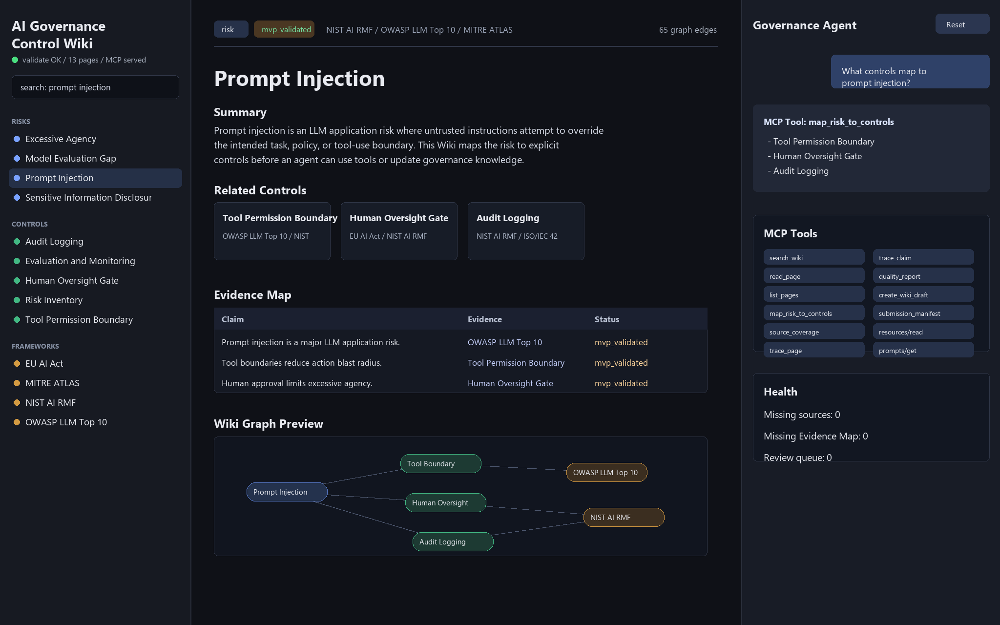

# Local Knowledge MCP Wiki

Markdown 자료를 넣으면 출처 추적 가능한 LLM Wiki draft를 만들고, 정적 viewer와 MCP-style JSON-RPC 서버로 사람이든 Agent든 같은 지식베이스를 조회할 수 있게 하는 실행 가능한 Wiki Tool입니다.

기본 예시는 AI Governance / AI Risk Control 지식베이스입니다. 처음 보는 사용자는 그대로 실행해 이미 만들어진 Wiki를 확인할 수 있고, 자기 raw 자료 1건을 넣어 자기 Wiki draft를 만들 수도 있습니다.

## 포함 항목

| 요구 항목 | 이 repo의 위치 |
| --- | --- |
| 하네스 | `AGENTS.md`, `RULES.md`, `hooks/preflight_check.py`, `.github/workflows/harness.yml` |
| SKILL 또는 Hook | `skills/wiki-curator/SKILL.md`, `hooks/preflight_check.py` |
| LLM Wiki | `raw/`, `wiki/`, `schema/`, `schemas/` |
| MCP 서버와 tools | `tools/mcp_server/`, `mcp_server/`, `tools/*.py` |
| Viewer | `viewer/index.html`, `app/index.html`, `app/wiki-data.js` |
| Demo evidence | `demo/mvp.png` |

## 30분 Quickstart

### 1. Clone

```powershell
git clone <YOUR_PUBLIC_REPO_URL>
cd <REPO_NAME>
```

### 2. 환경 확인

필요한 것은 Python 3.10 이상입니다. 외부 Python 패키지는 필요 없습니다.

```powershell
python --version
python hooks/preflight_check.py
```

정상 예시:

```text
PREFLIGHT OK
```

### 3. 기본 Wiki 검증

```powershell
python tools\mcp_server\smoke_test.py
python tools\validate_wiki.py
python tools\render_viewer_data.py
```

정상 예시:

```text
SMOKE TEST OK
pages=13 risks=4 graph_edges=65
```

### 4. Viewer 실행

```powershell
python -m http.server 8000
```

브라우저에서 엽니다.

```text
http://localhost:8000/app/index.html
```

왼쪽 페이지 목록, 검색창, Related Controls 카드, 그래프 노드를 클릭할 수 있습니다.

## 자기 자료 1건으로 첫 Wiki Draft 만들기

### 1. raw 자료 추가

예시 파일은 이미 있습니다.

```text
raw/inbox/sample-note.md
```

자기 자료를 넣으려면 `raw/inbox/my-note.md` 같은 파일을 만듭니다.

```markdown
# My First Note

This note describes one concept that should become a Wiki page.
It should keep source evidence and require review before becoming stable.
```

### 2. Dry-run preview

먼저 파일을 쓰지 않고 preview만 확인합니다.

```powershell
python tools\ingest.py raw/inbox/sample-note.md --title "My First Wiki Page"
```

### 3. 실제 draft 생성

```powershell
python tools\ingest.py raw/inbox/sample-note.md --title "My First Wiki Page" --write
```

결과는 `wiki/drafts/my-first-wiki-page.md`에 저장됩니다. 같은 draft가 이미 있으면 덮어쓰지 않고 `draft already exists`를 반환합니다.

### 4. 통합 요청 방법

Agent에게 다음처럼 요청하면 됩니다.

```text
raw/inbox/my-note.md를 기반으로 Wiki draft를 만들고,
quality_report와 trace_claim으로 검증한 뒤 viewer data를 갱신해줘.
stable page 승격은 사람이 검토하기 전까지 하지 마.
```

수동으로는 다음 순서입니다.

```powershell
python tools\ingest.py raw/inbox/my-note.md --title "My Topic" --write
python tools\validate_wiki.py
python tools\render_viewer_data.py
```

## MCP Server

실행:

```powershell
python tools\mcp_server\server.py
```

Tool discovery:

```json
{"jsonrpc":"2.0","id":1,"method":"tools/list","params":{}}
```

Tool call 예시:

```json
{"jsonrpc":"2.0","id":2,"method":"tools/call","params":{"name":"quality_report","arguments":{}}}
```

## MCP Tool 목록

| Tool | 기능 |
| --- | --- |
| `search_wiki` | 키워드로 Wiki 페이지 검색 |
| `read_page` | slug로 Markdown 페이지 읽기 |
| `list_pages` | page type 또는 review status 기준 목록 조회 |
| `map_risk_to_controls` | risk page를 관련 control page에 매핑 |
| `get_wiki_graph` | risk-control-framework graph 반환 |
| `run_maintenance_check` | 유지보수 점검 실행 |
| `save_query_note` | 질문과 답변 draft를 `wiki/queries/`에 기록 |
| `health_report` | 최신 health report 읽기 |
| `source_coverage` | source file, Evidence Map, source_count 무결성 확인 |
| `trace_page` | 페이지 단위 source와 incoming/outgoing edge 추적 |
| `trace_claim` | Evidence Map claim을 raw source와 wiki link로 추적 |
| `quality_report` | frontmatter, source, Evidence Map, wikilink 품질 점수화 |
| `create_wiki_draft` | raw 자료 1건에서 review-needed draft 생성 또는 preview |
| `submission_manifest` | 제출 산출물, ZIP layout, Tool manifest 확인 |

MCP Resources와 Prompts도 제공합니다.

```json
{"jsonrpc":"2.0","id":3,"method":"resources/read","params":{"uri":"wiki://prompt-injection"}}
{"jsonrpc":"2.0","id":4,"method":"prompts/get","params":{"name":"governance_answer","arguments":{"query":"prompt injection"}}}
```

## 검증 방법

전체 로컬 검증:

```powershell
python hooks\preflight_check.py
python tools\mcp_server\smoke_test.py
python tools\validate_wiki.py
python tools\render_viewer_data.py
powershell -NoProfile -ExecutionPolicy Bypass -File .\scripts\maintenance_check.ps1
```

기대 결과:

- preflight: `PREFLIGHT OK`
- smoke: `SMOKE TEST OK`
- quality: `status: pass`, `blocking_issue_count: 0`
- maintenance: `Blocking issues: 0`
- viewer data: `app/wiki-data.js` 생성

## Demo

`demo/mvp.png`는 실제 지식베이스가 viewer에 렌더링된 화면 캡처입니다.



## Repo 공개 주의

이 repo는 public으로 게시해야 평가 조건을 만족합니다. 검색 노출을 줄이고 싶다면 repo 이름, description, topic, README에 특정 학교명/과목명/강의명을 넣지 않는 편이 좋습니다.

파일 갱신 시각: 2026-06-15 00:00:00 +09:00
